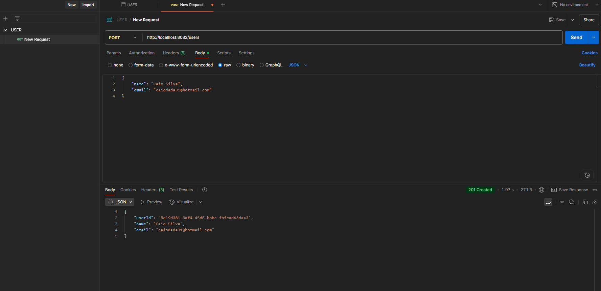

# 📨 Microservices - User Registration + Email Sender

---

## 📑 Description | Descrição

🇬🇧 This is a **Microservices architecture project**, developed with **Java 21** and **Spring Boot**, demonstrating:

* ✅ **User registration service (`user`)**.
* ☁️ Message publishing to **RabbitMQ (CloudAMQP)**.
* ✉️ Email sending service (`email`) consuming the queue to send emails asynchronously.

> Each microservice is independent, has its own PostgreSQL database, and communicates via RabbitMQ.

---

🇧🇷 Este é um projeto baseado em **arquitetura de microsserviços**, desenvolvido com **Java 21** e **Spring Boot**, que realiza:

* ✅ **Cadastro de usuários (`user`)**.
* ☁️ Publicação de mensagens na fila do **RabbitMQ (CloudAMQP)**.
* ✉️ Serviço de envio de emails (`email`) que consome a fila de forma assíncrona.

> Cada microsserviço é independente, possui seu próprio banco PostgreSQL e se comunica via RabbitMQ.

---

## 🏗️ Architecture | Arquitetura

```plaintext
[ CLIENT | CLIENTE ]
        ↓
POST /users
        ↓
[ USER ] 
        → Publishes to RabbitMQ (CloudAMQP) | Publica na fila RabbitMQ
                ↓
          [ EMAIL ] 
                → Consumes the queue | Consome da fila
                → Sends the email | Envia o email
```

---

## 🚀 Technologies | Tecnologias

* ☕ **Java 21**
* 🌱 **Spring Boot 3**
* 🐇 **RabbitMQ (CloudAMQP)**
* 📧 **Spring Mail (Java Email Sender)**
* 🐘 **PostgreSQL**
* 🐳 **Docker**

---

## 🔗 Endpoints

### ✅ User Registration | Cadastro de Usuário (`ms-user`)

**POST** `/users`

📥 **Request Body | Corpo da Requisição:**

```json
{
    "name": "Caio Silva",
    "email": "caiodada31@com"
}
```

🟢 **Response | Resposta:** 201 Created

| Field     | Description (EN)                 | Descrição (PT)                      |
| --------- | -------------------------------- | ----------------------------------- |
| id        | UUID generated                   | UUID gerado                         |
| name      | User name                        | Nome do usuário                     |
| email     | User email                       | Email do usuário                    |
| status    | Email status (`SENT` or `ERROR`) | Status do email (`SENT` ou `ERROR`) |
| createdAt | Creation date                    | Data de criação                     |

---

## 🖼️ Request Example | Exemplo de Requisição



---

## ⚙️ Configuration | Configuração

### 🔸 `application.properties` for **user**

```properties
spring.rabbitmq.addresses=amqps://<user>:<password>@<host>.cloudamqp.com/<vhost>


```

---

### 🔸 `application.properties` for **email**

```properties
spring.rabbitmq.addresses=amqps://<user>:<password>@<host>.cloudamqp.com/<vhost>

# Email Sender Configuration | Configuração do Envio de Email
spring.mail.host=smtp.gmail.com
spring.mail.port=587
spring.mail.username=<your-email>@gmail.com
spring.mail.password=<your-app-password>
spring.mail.protocol=smtp
spring.mail.properties.mail.smtp.auth=true
spring.mail.properties.mail.smtp.starttls.enable=true
```

✔️ **Important | Importante:** For Gmail, you must use an **App Password**, not your main password. ([How to generate it | Como gerar](https://myaccount.google.com/apppasswords))

---

## 🐳 Running the Project | Executando o Projeto

1. Clone the repository | Clone o repositório:

```bash
git clone https://github.com/caio20538/Email_Sender.git
cd Email_Sender
```

2. Start the databases with Docker Compose | Suba os bancos de dados com Docker:

```bash
cd .\user\docker\
docker compose up -d
```

3. Configure `application.properties` with your **CloudAMQP** credentials and **Email Sender** credentials.
   \| Configure seus arquivos `application.properties` com suas credenciais do **CloudAMQP** e do **Email Sender**.

4. Run both projects (`user` and `email`) | Execute ambos os projetos na sua IDE ou terminal:

```bash
./mvnw spring-boot:run
```

---

## 🗄️ Database | Banco de Dados

* `user`: Stores user data | Armazena dados dos usuários.
* `email`: Stores email logs and statuses (`SENT` or `ERROR`) | Armazena logs e status dos emails enviados.

---

## 📜 Workflow | Funcionamento

🇬🇧

1. The client sends a **POST** request to `/users` in the `user` service.
2. `user` registers the user and sends a message to RabbitMQ.
3. `email` consumes the message, processes it, and sends the email.
4. The email status (`SENT` or `ERROR`) is saved in the email database.

🇧🇷

1. O cliente faz uma requisição **POST** para `/users` no serviço `user`.
2. O `user` cadastra o usuário e envia uma mensagem para o RabbitMQ.
3. O `email` consome essa mensagem, processa e envia o email.
4. O status do email (`SENT` ou `ERROR`) é salvo no banco do serviço de email.

---

## 🤝 Contribution | Contribuição

Feel free to fork, open issues or submit pull requests! 🚀
Sinta-se à vontade para fazer um fork, abrir issues ou enviar pull requests! 🚀

---

## 📄 License | Licença

This project is under the MIT License. See the file [LICENSE](LICENSE) for details.
Este projeto está sob a licença MIT. Veja o arquivo [LICENSE](LICENSE) para mais detalhes.

---

## 🔗 Repository | Repositório

➡️ [https://github.com/caio20538/Email\_Sender](https://github.com/caio20538/Email_Sender)

---
